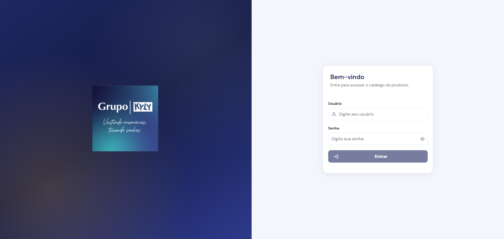
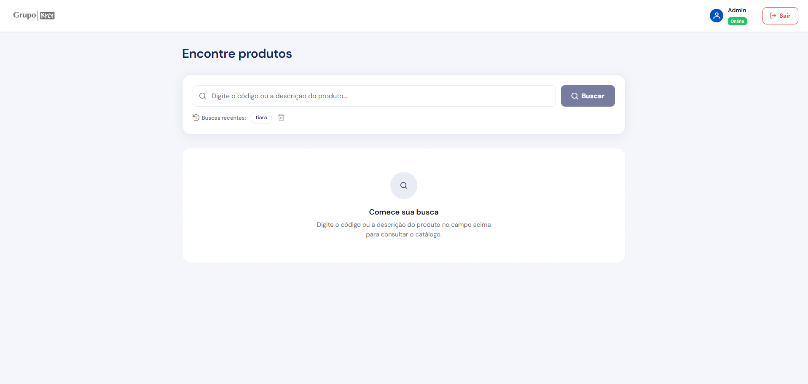
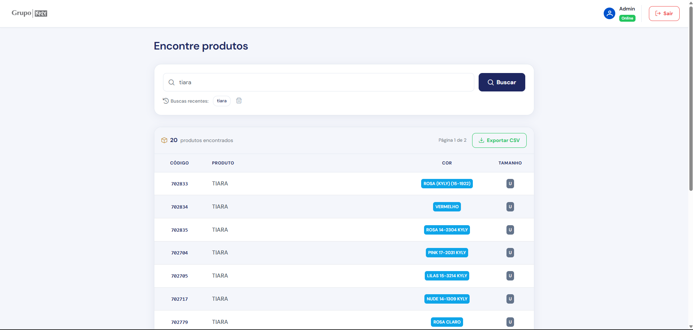
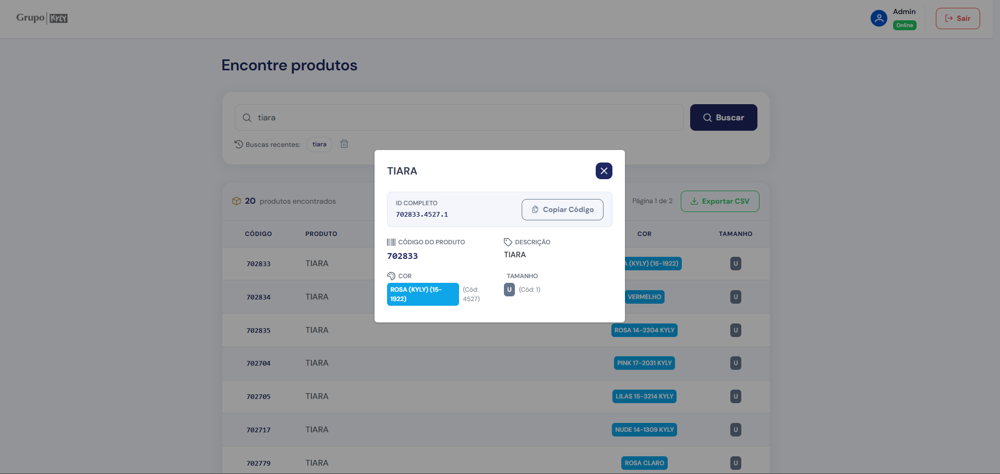
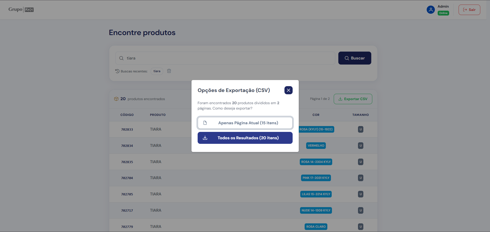

# Teste Full Stack - Grupo Kyly

Solução completa desenvolvida para o desafio técnico do Grupo Kyly. A aplicação consiste em uma API REST desenvolvida em C# (.NET 10) integrada a um banco de dados PostgreSQL e um frontend dinâmico em Angular 19 com componentes PrimeNG.

---

## 1. Estrutura do Projeto

O projeto foi estruturado seguindo os princípios de Clean Code, separação de responsabilidades e isolamento de dependências.

```text
teste-fullstack-kyly/
├── docker-compose.yml           # Orquestração do Banco, Backend e Frontend
├── .env                          # Variáveis de ambiente e segredos
├── sample_db/                    # Banco de dados em CSV (sample_db.csv)
├── images/                       # Capturas de tela da aplicação
├── src/
│   ├── banckend/                 # Solução C# (.NET 10)
│   │   ├── KylyApi/              # API Web REST principal
│   │   │   ├── Controllers/      # Endpoints (Produtos, Autenticação)
│   │   │   ├── Services/         # Regras de Negócio e Serviços JWT
│   │   │   ├── Data/             # DbContext, Migrations e DataSeeder
│   │   │   ├── Models/           # Entidades (Produto, ListaRelevancia, User)
│   │   │   └── DTOs/             # Objetos de Transferência de Dados
│   │   └── kylyApi.Tests/        # Projeto de Testes Unitários e de Integração
│   │       ├── Controllers/      # Testes de Controllers (Moq)
│   │       ├── Services/         # Testes de Serviços com Testcontainers (Postgres)
│   │       └── Intregration/     # Testes de Endpoints (WebApplicationFactory)
│   └── frontend/                 # Aplicação Angular 19 (SPA)
│       └── src/app/
│           ├── core/             # Serviços (Auth, Produto), Guards e Models
│           ├── features/         # Módulos da aplicação (Busca, Tabela, Auth)
│           └── shared/           # Componentes compartilhados (Cabeçalho, Modais)
```

### Tecnologias e Pacotes Utilizados

#### Backend (.NET 10 C#)
* **Framework Principal**: C# (.NET 10 Web API).
* **Npgsql.EntityFrameworkCore.PostgreSQL**: Provedor do Entity Framework Core para comunicação com o banco PostgreSQL.
* **Microsoft.AspNetCore.Authentication.JwtBearer**: Middleware de autenticação e validação de tokens JWT.
* **Microsoft.AspNetCore.Identity.EntityFrameworkCore**: Gerenciamento de usuários, credenciais e controle de acesso.
* **Microsoft.EntityFrameworkCore.Tools**: Ferramentas para criação e aplicação de migrations do banco de dados.
* **Microsoft.AspNetCore.OpenApi** e **Swashbuckle.AspNetCore.SwaggerUI**: Geração e exibição da documentação interativa da API via Swagger.

#### Pacotes de Testes (Backend)
* **xUnit**: Framework de execução de testes unitários e de integração.
* **Testcontainers.PostgreSql**: Criação dinâmica de containers isolados do PostgreSQL durante a execução dos testes.
* **Microsoft.AspNetCore.Mvc.Testing**: Infraestrutura para testes de integração de endpoints (WebApplicationFactory).
* **Moq**: Biblioteca para criação de objetos simulados (Mocks).
* **FluentAssertions**: Escrita de asserções de teste legíveis e expressivas.

#### Frontend (Angular 19)
* **Framework Principal**: Angular 19 (Componentes Standalone).
* **PrimeNG & PrimeIcons**: Biblioteca de componentes visuais (Tabelas, Modais, Botões, Paginadores).
* **RxJS**: Programação reativa para gerenciamento de requisições, busca dinâmica (Debounce) e execução paralela (forkJoin).
* **Servidor Web**: Nginx para servir os arquivos estáticos compilados em ambiente Docker.

#### Banco de Dados e Infraestrutura
* **PostgreSQL 17**: Banco de dados relacional.
* **Docker & Docker Compose**: Automatização e orquestração dos containers de aplicação.

---

## 2. Como Subir e Executar o Projeto

### Pré-requisitos

Para executar o projeto, você pode escolher o modo de execução via **Docker Compose** (recomendado, sem necessidade de instalar SDKs locais) ou o modo de **Desenvolvimento Local**.

#### Ferramentas Necessárias:
* [Docker Desktop](https://www.docker.com/products/docker-desktop/) (para execução via containers).
* [.NET 10 SDK](https://dotnet.microsoft.com/download/dotnet/10.0) (apenas se for compilar ou rodar o backend fora do Docker).
* [Node.js v18+](https://nodejs.org/) e npm (apenas se for rodar o frontend fora do Docker).

---

### Opção A: Execução Completa via Docker Compose (Recomendado)

Neste modo, o Docker compila o backend, instala as dependências do frontend (npm install), aplica as migrations no PostgreSQL e popula os dados automaticamente.

1. **Clonar o Repositório**:
   ```bash
   git clone https://github.com/francisco-neto26/teste-fullstack-kyly.git
   cd teste-fullstack-kyly
   git checkout feature/solucao-projeto
   ```

2. **Iniciar os Containers**:
   Na raiz do repositório, execute:
   ```bash
   docker-compose up -d --build
   ```

3. **Acessar a Aplicação**:
   * **Frontend (Interface Web)**: [http://localhost](http://localhost)
   * **Backend (Documentação Swagger)**: [http://localhost:8080/swagger](http://localhost:8080/swagger)


---

### Opção B: Execução Manual / Desenvolvimento Local

Caso prefira rodar os projetos diretamente em sua máquina de desenvolvimento:

1. **Restaurar e Subir o Backend (.NET)**:
   ```bash
   cd src/banckend/KylyApi
   dotnet restore
   dotnet run
   ```

2. **Instalar Dependências e Subir o Frontend (Angular)**:
   ```bash
   cd src/frontend
   npm install
   npm start
   ```
   O frontend estará disponível em [http://localhost:4200](http://localhost:4200).

---

### Executando os Testes Automatizados do Backend

Os testes automatizados sobem um container de banco PostgreSQL temporário usando Testcontainers.

Para executar a suíte de testes:
1. Certifique-se de que o Docker Desktop está em execução.
2. Execute o comando no terminal:
   ```bash
   cd src/banckend/kylyApi.Tests
   dotnet restore
   dotnet test
   ```

---

## 3. Projeto Finalizado e Comportamento das Telas

### Visão Geral da Tela Principal
A interface foi desenvolvida para oferecer uma navegação limpa, responsiva e intuitiva.



---

### 1. Estado Inicial da Busca
Ao acessar a tela de busca, o sistema apresenta orientações para consulta por código ou descrição.



---

### 2. Busca Dinâmica em Tempo Real e Histórico Recente
* **Busca com Debounce**: A busca é executada automaticamente após 600ms de pausa na digitação. O campo permanece com o foco e o cursor ativo sem travamentos.
* **Histórico de Buscas (localStorage)**: Registra os últimos 5 termos pesquisados em botões de atalho clicáveis.



---

### 3. Ficha de Detalhes do Produto e Copiar Código
Ao clicar em qualquer linha da tabela, uma janela modal exibe a ficha completa do produto com opção de cópia do código com retorno visual de confirmação.



---

### 4. Exportação de Dados para CSV
O botão de exportação permite selecionar entre baixar apenas a página atual ou buscar todas as páginas em paralelo para gerar um arquivo CSV consolidado.



---

## 4. Requisitos da Regra de Negócio Implementados

1. **API REST com Busca por Palavra-Chave**: Filtro insensível a maiúsculas e minúsculas (EF.Functions.ILike) por código ou palavras da descrição.
2. **Priorização por Listas de Relevância**:
   * **Lista 1** (lista_relevancia_1.txt): Prioridade 1 (exibida em primeiro lugar).
   * **Lista 2** (lista_relevancia_2.txt): Prioridade 2 (exibida em segundo lugar).
   * **Demais Produtos**: Prioridade 3 (exibidos por último, ordenados pelo Id do produto).
3. **Paginação**: Retorno paginado em blocos de 15 registros.
4. **Autenticação**: Proteção de rotas via tokens JWT Bearer e integração com ASP.NET Core Identity.
